# Cyber Club DIT CTF – Writeup  
##  Written by: sUdO3  
##  Username: MR_r0b07  
##  Flag Format: `ccd{.......}`  

---

This repository documents how I solved several challenges from **CCD CTF – Phase 2**.  
The writeups are beginner-friendly and focus on clear, step-by-step explanations.

All content is for **educational and ethical purposes only**.

If something looks easy… it’s probably a trap 😅  
Happy hacking (ethically) 🚀

### CHALLENGE:Operation: Digital Ghost
### CATEGORY:Network Forensic
#### Description
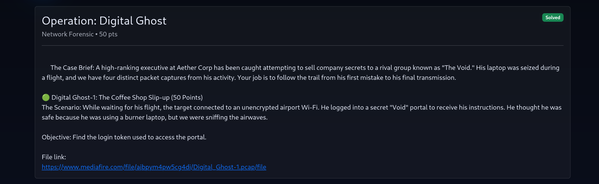

#### Solution
After downloading the provided file, I observed that it was a PCAP file named Digital_Ghost-1.pcap. The objective of the challenge was to find the login token used to access the portal.

Since this was a CTF challenge, before jumping into detailed network analysis using tools like Wireshark, I decided to perform a quick preliminary inspection. A good practice in forensics challenges is to first run simple commands to check for easily extractable information.

Therefore, I used the strings command on the PCAP file to search for any readable content:

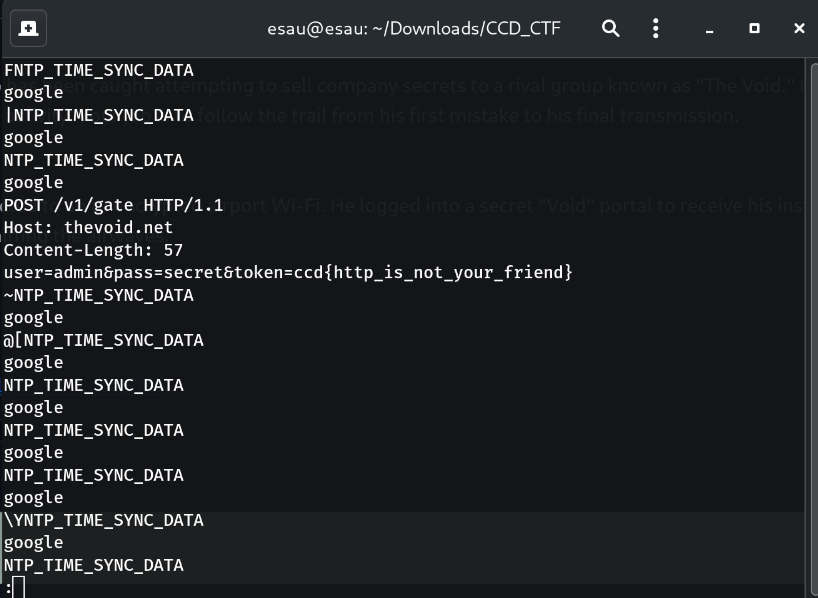
Surprisingly, the login token was visible directly in the output without requiring deeper packet analysis.

This demonstrates an important lesson in CTF problem-solving: always start with basic enumeration techniques before moving to advanced tools. Simple commands like strings can sometimes save significant time and effort.
##### Flag: ccd{http_is_not_your_friend}


### CHALLENGE:Digital Ghost-2: The Heartbeat Signal
### CATEGORY:Network forensic
#### Description
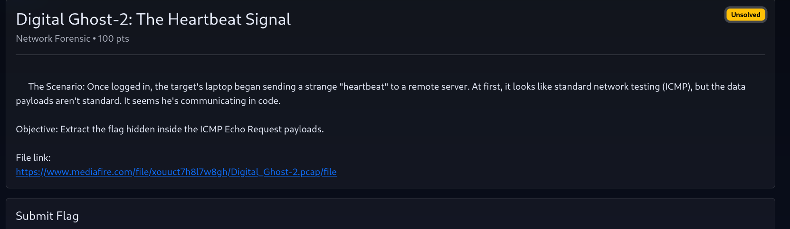
The scenario describes a laptop sending periodic ICMP "heartbeat" traffic to a remote server.

Although it initially appears to be normal ICMP ping traffic, the payload contents are non-standard and indicate hidden communication.

##### Objective
Extract the hidden flag embedded inside ICMP Echo Request payloads.
##### Extraction Method
I used tshark to automate extraction:
```
tshark -r Digital_Ghost-2.pcap -Y "icmp.type==8" -T fields -e data \
| xxd -r -p 2>/dev/null \
| grep -o 'DATA:.' \
| cut -d: -f2 \
| tr -d '\n'; echo
```
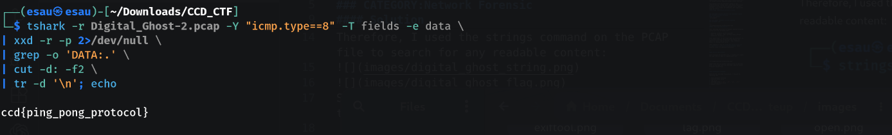
##### What It Does
```
tshark
```
Reads the PCAP file and extracts only ICMP Echo Request payloads (ping requests).
```
xxd -r -p
```
Converts the extracted hex data into readable ASCII text.
```
grep -o 'DATA:.'
```
Finds only strings that match DATA:<character>.
```
cut -d: -f2
```
Extracts just the character after DATA:.
```
tr -d '\n'
```
Joins all characters into one continuous string (the flag).
```
echo
```
Prints a clean newline at the end.
##### Flag: ccd{ping_pong_protocol}

### CHALLENGE:Digital Ghost-3: The Heartbeat Signal
### CATEGORY:Network forensic
#### Description
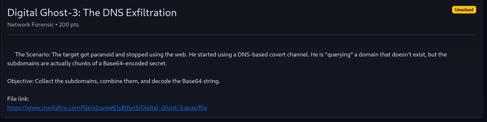
this is  DNS tunneling / DNS exfiltration challenge.

Instead of hiding data in ICMP, the attacker hides data inside DNS queries.
#### Goal

1. Extract DNS query names

2. Remove the real domain

3. Combine subdomain parts

4. Decode Base64
#### command used
```
tshark -r Digital_Ghost-3.pcap -Y "dns.qry.name" -T fields -e dns.qry.name
```
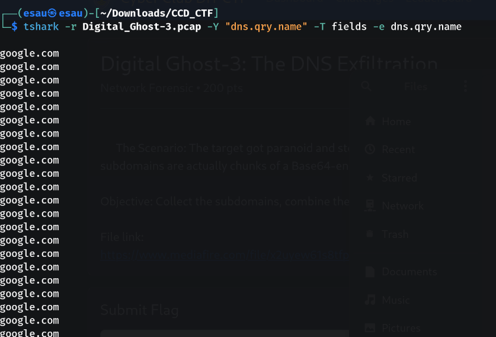
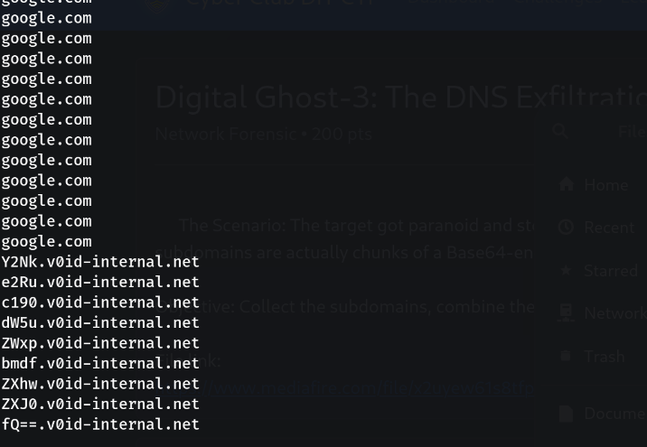
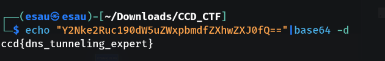
##### Flag ccd{dns_tunneling_expert}

### CHALLENGE:Digital Ghost-4: The Heartbeat Signal
### CATEGORY:Network forensic
#### Description
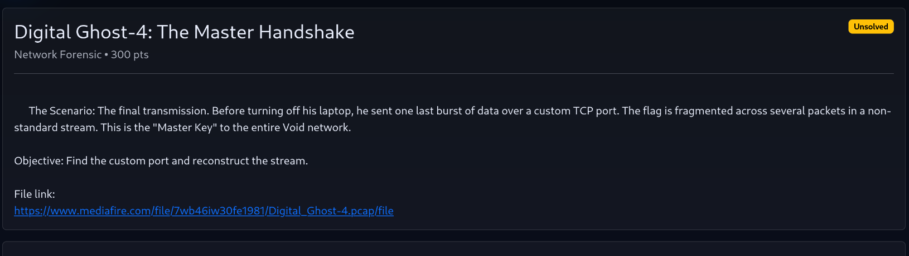
#### Goal

1. Identify the suspicious port.

2. Follow the related TCP stream.

3. Reassemble the transmitted data.

4. Extract the flag.

#### Solution

The challenge description mentioned that “he sent the last burst of data.”

This strongly suggested that the flag was likely transmitted in the final TCP communication stream. Based on this hint, I opened the provided PCAP file in Wireshark for analysis.

First, I examined the captured traffic to identify any unusual or suspicious ports. After locating the relevant port, I focused on the final TCP packets associated with that communication.

To inspect the data:

1. right-clicked on the last packet associated with the suspicious port.

2. selected Follow → TCP Stream.

Wireshark automatically reassembled the full TCP conversation, allowing me to view the complete transmitted data in readable form.

Upon reviewing the reconstructed stream, I successfully located the flag within the final burst of transmitted data.
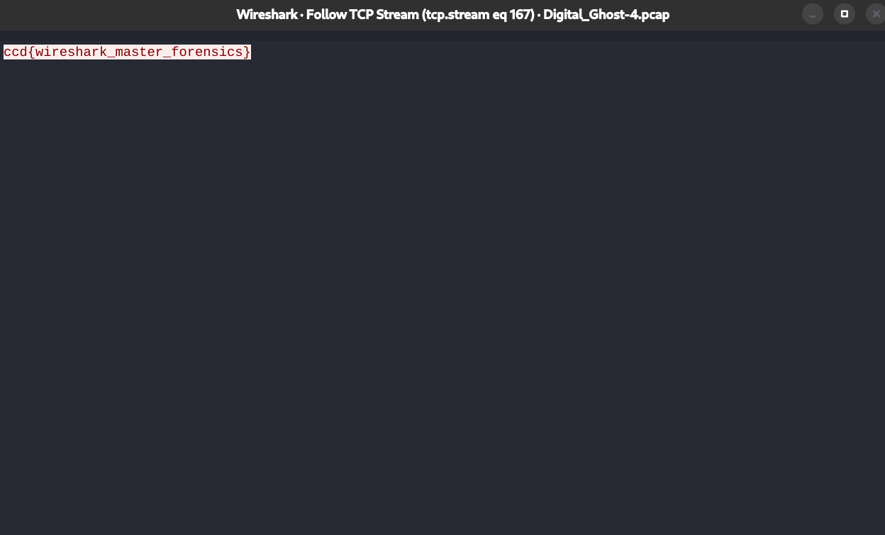
#### flag: ccd{wireshark_master_forensics}
### CHALLENGE: Internal Archive Exposure  
### CATEGORY: Web  

---
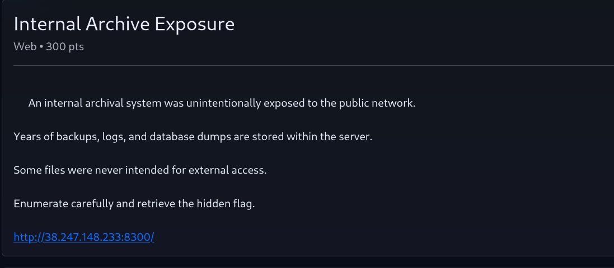
#####  Challenge Explanation

This challenge described an exposed internal archival system with the following hints:

- “Internal archival system exposed”
- “Years of backups, logs, database dumps stored”
- “Enumerate carefully”

From these clues, it was clear that the objective was to perform directory enumeration and search for sensitive files such as backups, logs, database dumps, or configuration files.  

This suggests a case of **improper access control** or **directory listing misconfiguration**, where internal files are publicly accessible.

---

#### Initial Observation

Upon visiting the provided link, I landed on a simple web page with no login or registration form.


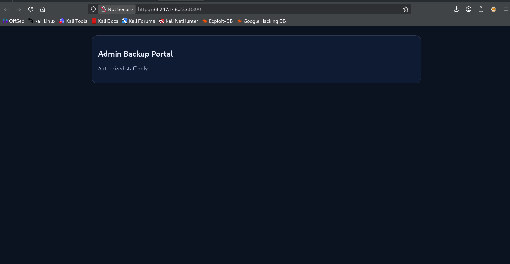

Since there was no visible functionality to interact with, I concluded that the challenge required manual directory enumeration.

---

#### Enumeration Strategy

Based on the challenge description, I focused on searching for:

1. Open directory listings  
2. Exposed backup files  
3. Log files  
4. Database dumps (`.sql`, `.db`, `.gz`, `.tar`)  
5. Old configuration files  
6. Hidden folders  

---

#### Step 1: Checking Logs

I began by enumerating directories using relevant keywords from the description. I first tested the `/logs` directory.

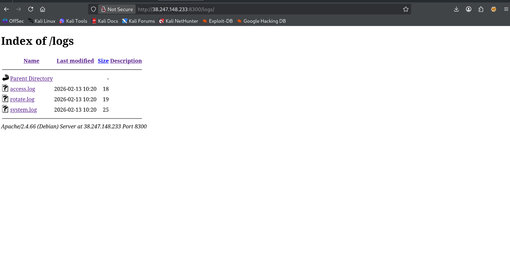

After exploring the directory, I found several files. However, they only contained fake flags and no useful information.

Since the logs did not reveal anything valuable, I shifted my focus to other likely directories.

---

#### Step 2: Checking Backups

Next, I navigated to the `/backups` directory.

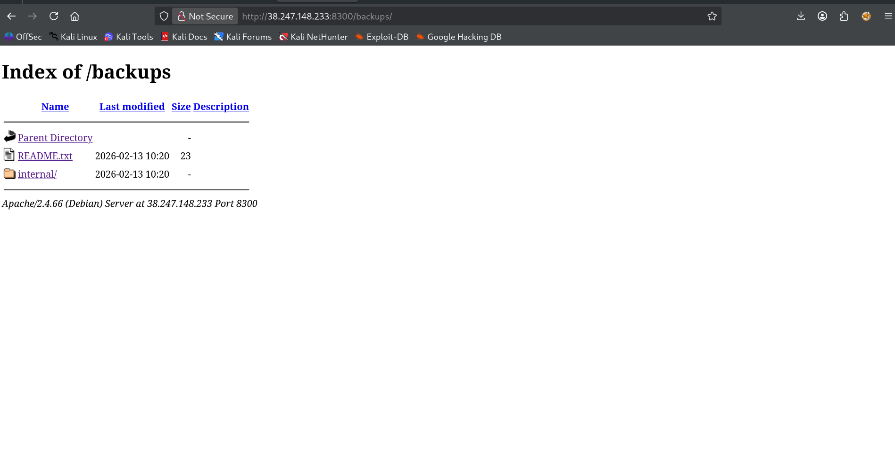

This directory contained archived files, which aligned with the challenge description about exposed backups.

After inspecting the available files, I discovered the flag inside one of the backup files.

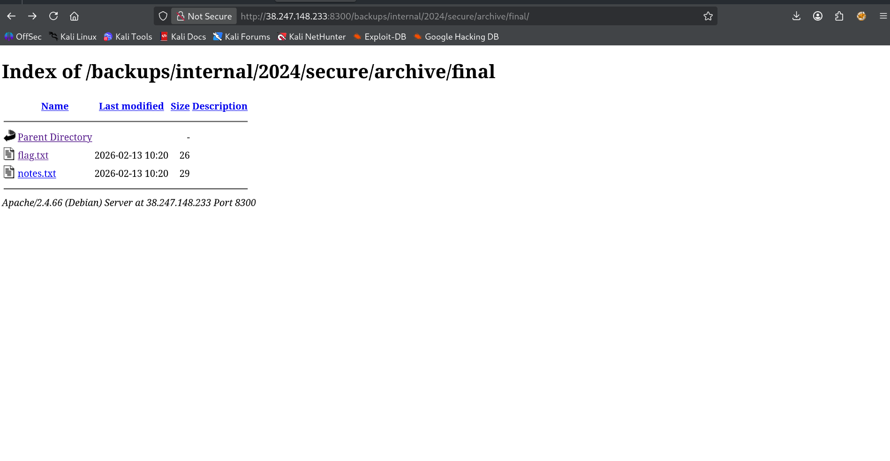

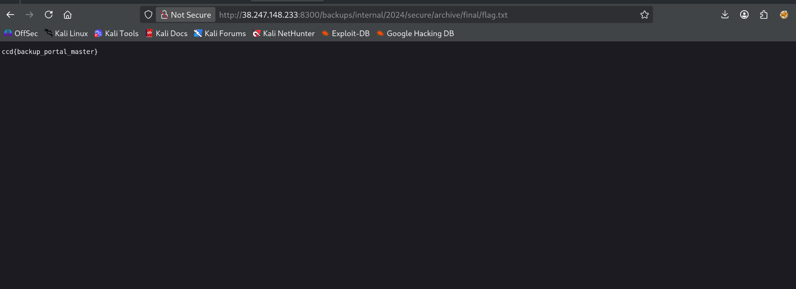

##### Flag:ccd{backup_portal_master}

### CHALLENGE: Captured Intruder Picture 
### CATEGORY: Digital forensics

#### Description
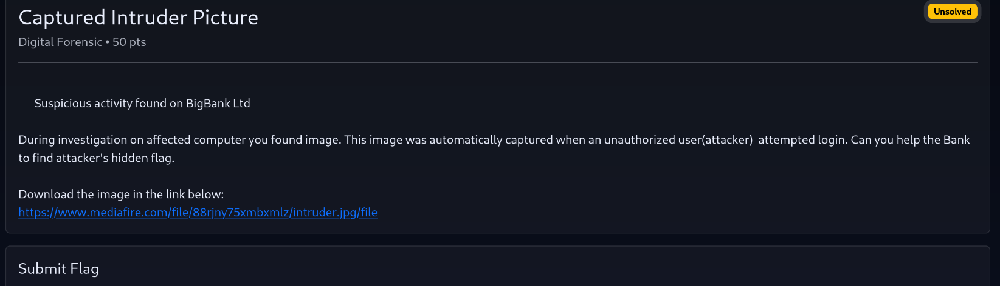

This challenge provided an image file named `intruder.jpg`. Based on the context and file type, it was clear that the task involved performing forensic analysis on the image to uncover hidden information.

The objective was to analyze the image metadata and determine whether any hidden data was embedded inside the file.

1. Metadata Analysis with ExifTool

I began by inspecting the image metadata using `exiftool`:

```bash
exiftool intruder.jpg
```
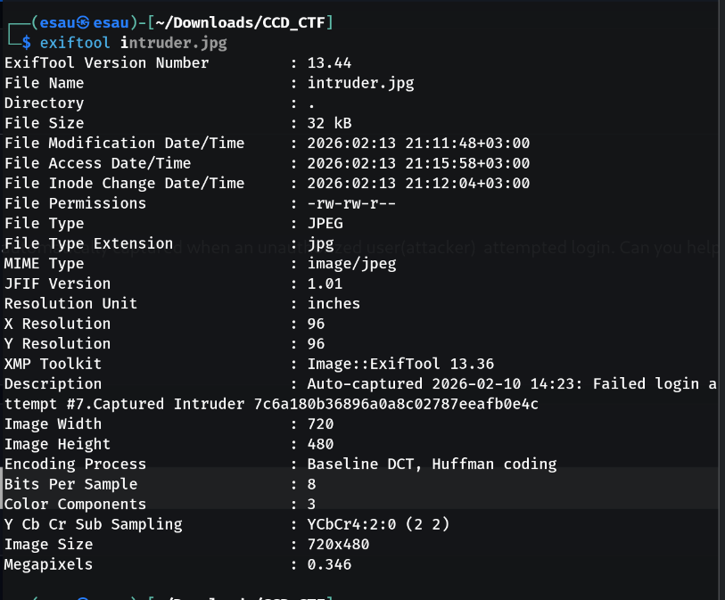
While reviewing the output, I noticed an interesting entry in the Description field:

Description : Auto-captured 2026-02-10 14:23: Failed login attempt #7.
Captured Intruder 7c6a180b36896a0a8c02787eeafb0e4c

The string 7c6a180b36896a0a8c02787eeafb0e4c appeared suspicious and resembled an MD5 hash.
2. Cracking the Hash

I copied the hash and checked it using an online hash database (CrackStation).
The hash was identified as MD5 and cracked successfully:
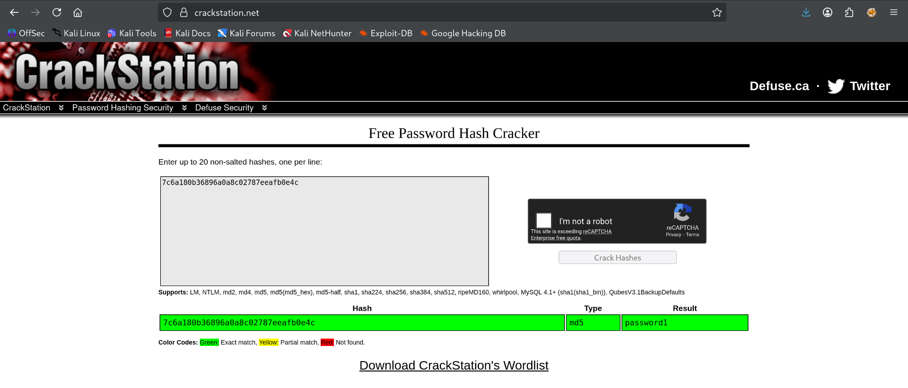
7c6a180b36896a0a8c02787eeafb0e4c → password1

This suggested that password1 might be a passphrase for hidden data inside the image.
 3. Checking for Hidden Data with Steghide

Next, I checked whether the image contained embedded data:
```
steghide info intruder.jpg
```
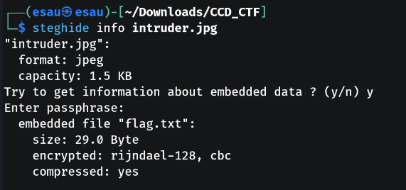
The output confirmed that embedded data existed:

    Embedded file: flag.txt

    Encrypted: rijndael-128 (AES)

    Compressed: Yes

This confirmed that the image was used for steganography.

 4. Extracting the Hidden File

Using the cracked passphrase, I extracted the hidden file:
```
steghide extract -sf intruder.jpg
```
When prompted for the passphrase, I entered:
```
password1
```
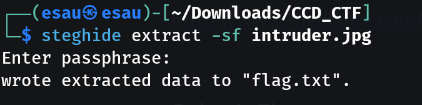
The extraction was successful, and a file named flag.txt was recovered.
5. Retrieving the Flag

Finally, I viewed the contents of the extracted file:
```
cat flag.txt
```
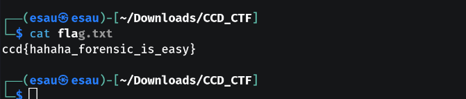


##### Flag: ccd{hahaha_forensic_is_easy}

### CHALLENGE: Are You Active
### CATEGORY: Warm up
##### Description
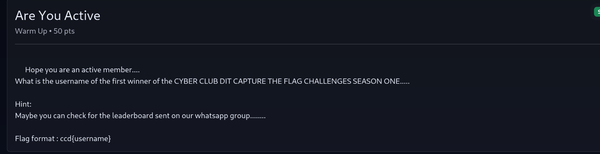
I just opened the document from CCD DIT WhatsApp group and found the username.
##### Flag: ccd{Shemsanofly_19}
### CHALLENGE: Mr Robot
### CATEGORY: Warm up
##### Description
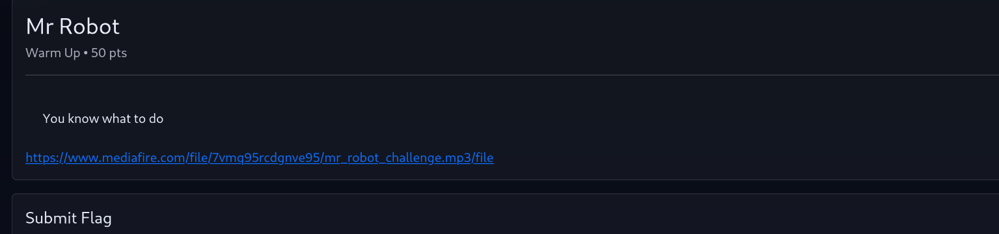
#### Solution

After downloading the provided file, I noticed that it was an `.mp3` file.  
The first step in any forensic challenge involving media files is to inspect the metadata.

To do this, I used `exiftool`:

```bash
exiftool mr_robot_challenge.mp3
```
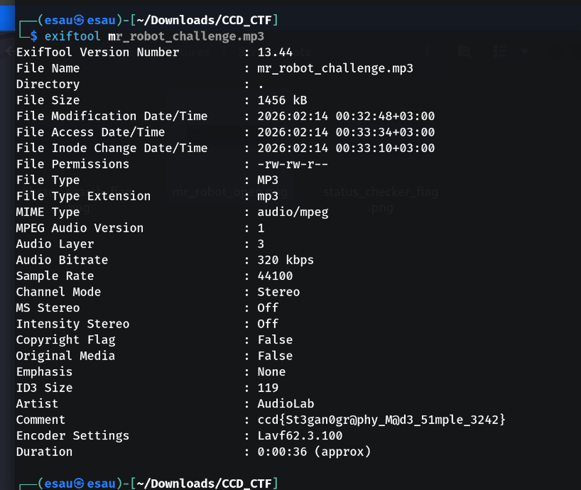


Boom! The flag was sitting comfortably in the metadata like it paid rent to be there 😅
##### Flag: ccd{St3gan0gr@phy_M@d3_51mple_3242}
### CHALLENGE: Unsecure Backup
### CATEGORY: Digital Forensic
##### Description
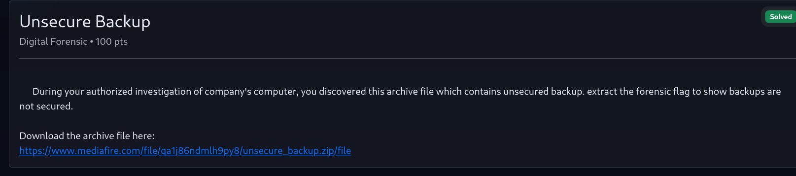
##### Solution
We were given a file:
```
unsecure_backup.zip
```
When attempting to extract it, the archive prompted for a password:
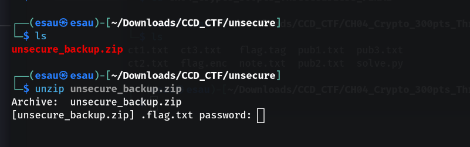
This indicates that the ZIP archive is encrypted.

Our objective was to recover the password and retrieve the hidden flag.
1. Extract the ZIP Hash
Since the ZIP was password-protected, I converted it into a crackable hash format using zip2john:
```
zip2john unsecure_backup.zip > hash.txt
```
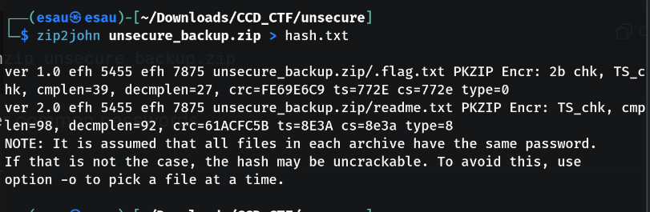
This generated a hash representation of the encrypted archive suitable for password cracking.

2. Crack the Password

To recover the password, I used 
```
John
```
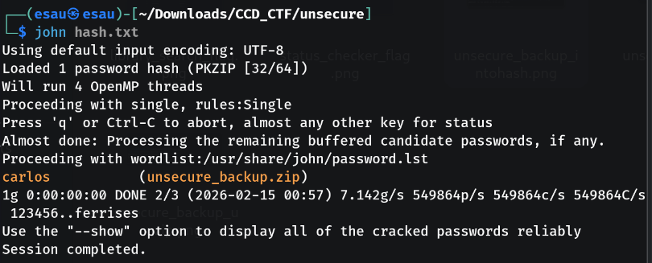
password Found
`carlos`

3. Extract the Archive
use the recovered password
```
unzip unsecure_backup.zip
```


I first tried reading the `readme.txt` file to see if it contained any useful information. However, after inspecting its contents, I found nothing relevant.

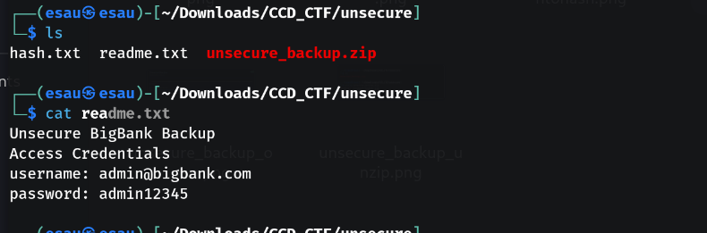

Since the obvious file did not reveal anything, I decided to check for hidden files in the directory.

After listing all files, including hidden ones, I discovered a suspicious file named `.flag.txt`.

Upon opening this file, I successfully retrieved the flag.
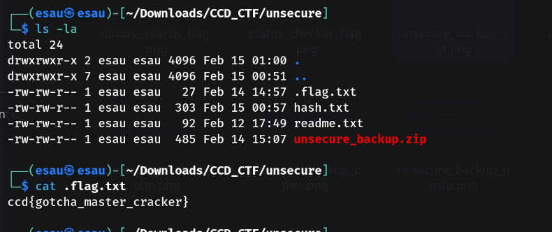
##### Flag:ccd{gotcha_master_cracker}

### CHALLENGE: Blackout
### CATEGORY: Digital Forensic
#### Description
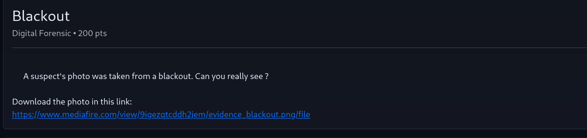
We were provided with a PNG image:
`evidence_blackout.png`
At first glance, the image appeared completely black. The challenge name “Blackout” hinted that the flag might be hidden visually rather than through typical encoding or encryption.

Our objective was to recover the hidden flag.
  1. Initial File Inspection

First, I verified the file type:
```
file evidence_blackout.png
```
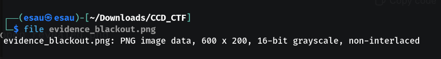
The image being 16-bit grayscale is unusual and often suggests possible steganography or visual data hiding techniques.
2. Search for Embedded Data

I used `binwalk` to check for embedded or appended data:
```
binwalk evidence_blackout.png
```
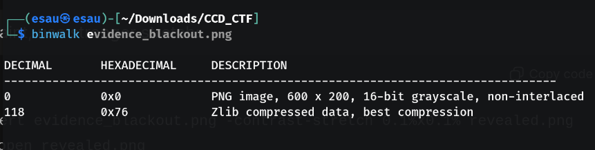
The output indicated embedded compressed data inside the PNG.
3. Extract and Decompress the Zlib Block

I extracted the embedded data:
```
binwalk -e evidence_blackout.png
```
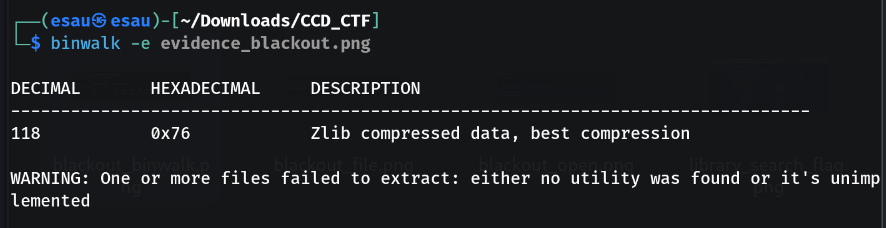
This created:
```
76.zlib
```

Then decompressed it:
```
python3 -c "import zlib; open('output.bin','wb').write(zlib.decompress(open('76.zlib','rb').read()))"
```
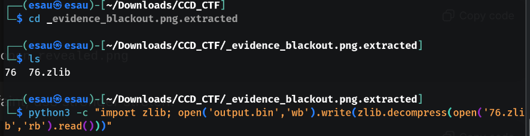

However, inspecting the output revealed mostly null bytes:
```
xxd output.bin | head
```
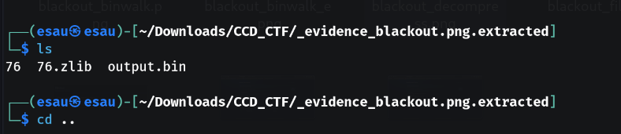
This suggested that the decompressed data was likely raw pixel data and not the flag itself.
Since:

1. No readable strings were found

2. No meaningful content was extracted

3. The image appeared fully black

I suspected low-contrast visual hiding rather than embedded steganographic payloads.
To test this theory, I applied histogram stretching using ImageMagick.
```
convert evidence_blackout.png -contrast-stretch 0.1%x0.1% revealed.png
```
to open it
```
xdg-open revealed.png
```
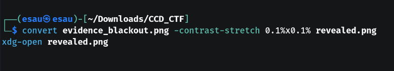
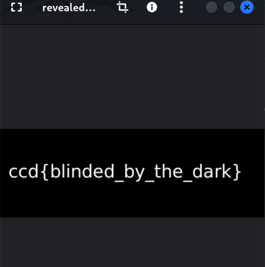
##### Flag: ccd{blinded_by_the_dark}
