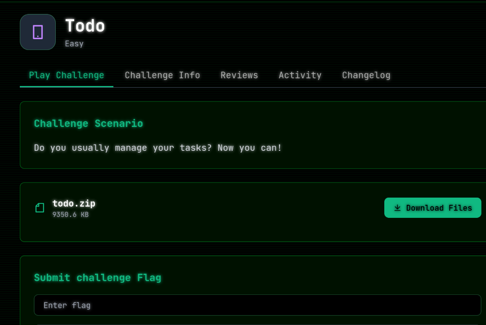
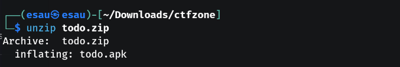
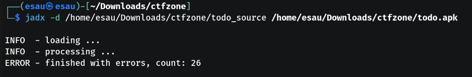
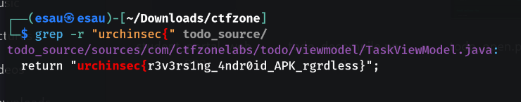
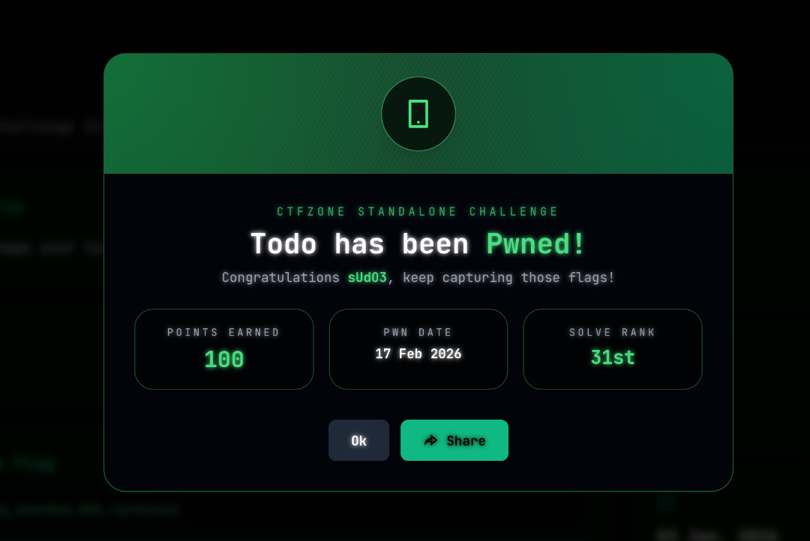

# Todo APK – Reverse Engineering Writeup
### Challenge Description


We were given a file:
`todo.zip`

 1. Extract the ZIP File

First, I extracted the archive:
```
unzip todo.zip
```

After extraction, I saw,
`todo.apk`


This means the challenge is about Android APK reverse engineering.

 2. Decompile the APK

To analyze the source code, I used jadx:
```
jadx -d /home/esau/Downloads/ctfzone/todo_source /home/esau/Downloads/ctfzone/todo.apk
```

Even though jadx showed:
```
ERROR - finished with errors, count: 26
```

It still successfully generated the folder:
`todo_source/`


4. Search for Hardcoded Flag in Source Code

Instead of manually reading files, I used grep to search inside the decompiled source:
```
grep -r "urchinsec{" todo_source/
```



💥 BOOM!

The flag was directly hardcoded inside:
`TaskViewModel.java`

#### 🏁 Final Flag: urchinsec{r3v3rs1ng_4ndr0id_APK_rgrdless}
