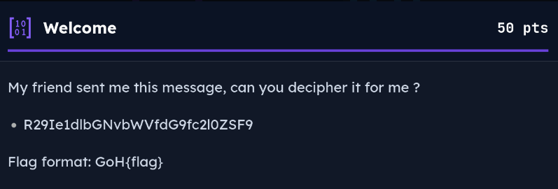
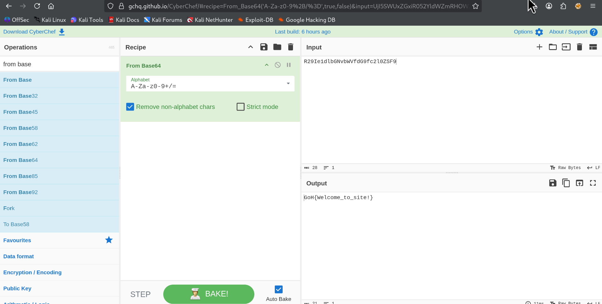
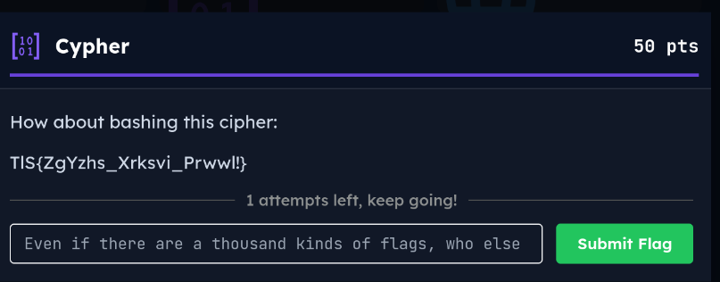
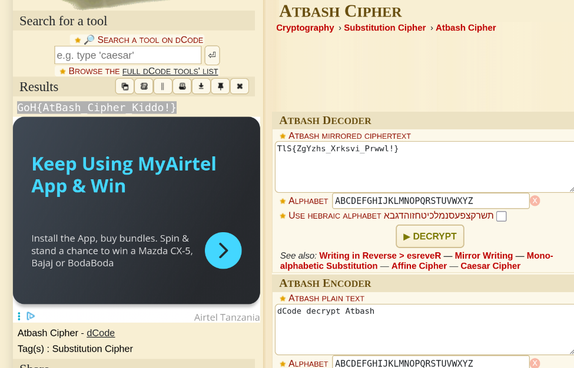
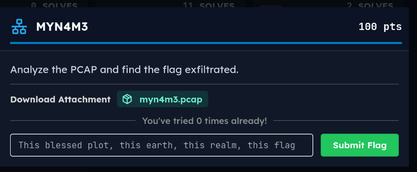
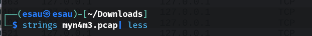
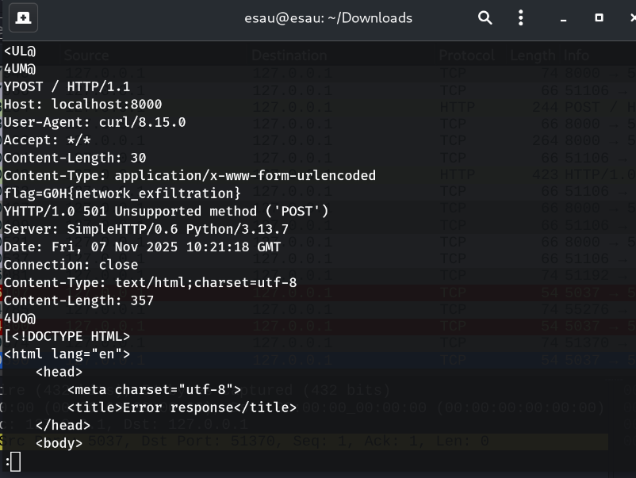
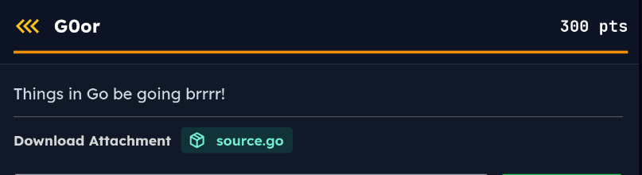
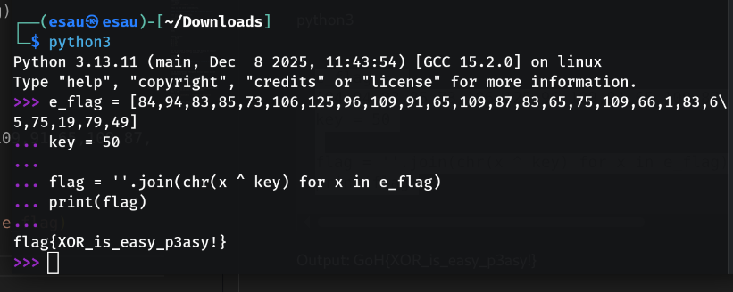

# CTF WRITEUP
## PLATFORM: https://simulations.h4k-it.com/games/14/challenges#
## USERNAME: sUdO3
### 1.Welcome
### Category: Crypto

After examining the given file, I noticed that the content was Base64 encoded. I extracted the encoded string and pasted it into CyberChef, where I applied the From Base64 operation to decode it.

#### flag:GoH{Welcome_to_site!}

### 2.Cypher
### Category: crypto

After examining the given cipher text, I identified that it uses the Atbash cipher, a classical substitution cipher where each letter is replaced by its reverse counterpart in the alphabet (A ↔ Z, B ↔ Y, etc.).

To decode it, I used an online decoding tool called dCode and applied the Atbash cipher operation.

#### flag:
GoH{AtBash_Cipher_Kiddo!}

### 3.MYN4M3
### Category: NETWORKING

The challenge description states: “Analyze the PCAP and find the exfiltrated flag.”
For this challenge, a .pcap file was provided as an attachment.
Network exfiltration refers to the unauthorized transfer of data from a system to an external destination over a network. In some cases, sensitive data is transmitted in clear text within network packets, making it possible to recover using simple tools like
``` bash
 strings
 ```
  without deep packet inspection. This highlights the importance of encrypting sensitive network communications.
Before opening the file in Wireshark, I first used the strings command to quickly check whether any human-readable data—such as a flag—was embedded directly in the captured traffic. This is often effective when data is exfiltrated in plain text or without proper obfuscation.

after running this command boom, i got the flag 
#### flag:G0H{network_exfiltration}

### 4.GOor
### Category: REV-ENGINEERING

After opening the provided attachment, I observed that it contained a script written in the Go (Golang) programming language.
``` bash
package main

import (
	"fmt"
	"bufio"
	"os"
	"strings"
	"strconv"
	b64 "encoding/base64"
)

func main () {
	secret := "*********";
	fmt.Println("Welcome to my simple Calculator implementation!\n@trustie_rity\n");

	reader := bufio.NewReader(os.Stdin);
	fmt.Println("\nBasic Calculator (+, -, *, /)\n");
	fmt.Println("[!] Enter two numbers and an Operator eg 3 + 5 \n[!] exit -> to Exit the program\n");

	for {
		fmt.Print("Input: ");
		input, _ := reader.ReadString('\n'); 
		input = strings.TrimSpace(input);

		// Exit condition
		if input == "exit" {
			fmt.Println("[+] Goodbye :)\n")
			break
		}
		// Secret Condition
		if input == secret {
			salt := b64.StdEncoding.EncodeToString([]byte(secret));
			fmt.Println(haha(salt));
			break
		}

		// normal calculation
		parts := strings.Fields(input);
		if len(parts) != 3 {
			fmt.Println("\n[-] Error! Enter number operator number\n");
			continue
		}

		// parse numbers
		number1, err := strconv.ParseFloat(parts[0], 64);
		if err != nil {
			fmt.Println("\n[-] Invalid First Number!");
			continue
		}

		number2, err := strconv.ParseFloat(parts[2], 64);
		if err != nil {
			fmt.Println("\n[-] Invalid Second Number!");
			continue
		}

		// Calculation
		result, err := calculate(number1, number2, parts[1]);
		if err != nil {
			fmt.Println("\n[-] Invalid operator, Calculation Failed!", err);
			continue
		}

		fmt.Printf("[+] Results = %.2f\n", result);
	}
}


func calculate(num1, num2 float64, operator string) (float64, error) {
	switch operator{
	case "+": 
		return num1 + num2, nil
	case "-":
		return num1 - num2, nil
	case "*":
		return num1 * num2, nil
	case "/":
		if num2 == 0 {
			return 0, fmt.Errorf("\n[-] Division by zero!\n")
		}
		return num1 / num2, nil
	default:
		return 0, fmt.Errorf("\n[-] Invalid Operator!\n")

	}
}

func haha(salt string) (string) {
	fmt.Println("\n[+] The salt is : ", salt);
	reader := bufio.NewReader(os.Stdin);
	input, _ := reader.ReadString('\n');
	input = strings.TrimSpace(input);
	check := []byte(input)
	
	key := byte(salt[1])
	//result := make([]byte, len(passphrase))
// e_flag = 84,94,83,85,73,106,125,96,109,91,65,109,87,83,65,75,109,66,1,83,65,75,19,79,49
	e_flag := [...]int{ *, *, *,* ,*v, *, *, *, *, *, *, *, *}
	
    	for i, b := range []byte(check) {
		if byte(e_flag[i]) ==  b ^ key {
			continue
		}else {
			return "\n[-] Failed";
		}
    	}
	return "\n[+] Congratulations, That is the flag\n";
}
```
#### 1️⃣ Static Analysis – Read the Source Code

First thing: read the code, don’t run it blindly.
What we immediately learn
``` bash
From haha():

key := byte(salt[1])
if byte(e_flag[i]) == b ^ key
```
📌 This tells us:
XOR encryption is used
``` bash
flag[i] ^ key = e_flag[i]
```
Therefore:
``` bash
flag[i] = e_flag[i] ^ key
```
This is the core vulnerability.

#### 2️⃣ Identify the XOR Key

The key is derived from:
``` bash
salt := base64(secret)
key := byte(salt[1])
```

We don’t even need the secret.
Because flags have a known prefix:

GoH{


ASCII values:
``` bash
G = 71
o = 111
H = 72
{ = 123
```

If we extract e_flag[0] from the binary or comment and XOR it with 'G', we get the key.
You already know:

GoH{...}


So the first character of the flag is:
'G'
ASCII value of 'G':
71

##### Get the First Encrypted Byte

From the challenge data:
``` bash
// e_flag = 84,94,83,85,...
```

So:

e_flag[0] = 84

##### Compute the Key 

Formula:
``` bash
key = encrypted_byte XOR known_plaintext_byte
```
So:
key = 84 XOR 71

###### Key = 50

4️⃣ Decrypt Using python3

Once you have the encrypted bytes(which we already have in given codes):

python3
``` bash
e_flag = [84,94,83,85,73,106,125,96,109,91,65,109,87,83,65,75,109,66,1,83,65,75,19,79,49]
key = 50

flag = ''.join(chr(x ^ key) for x in e_flag)
print(flag)
```

#### flag:GoH{XOR_is_easy_p3asy!}