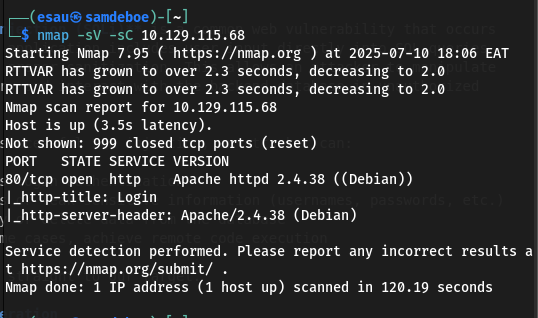
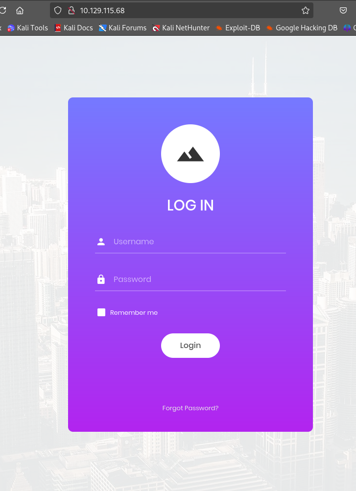
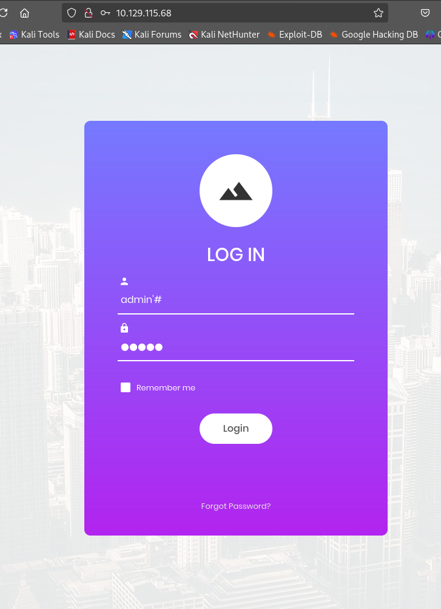
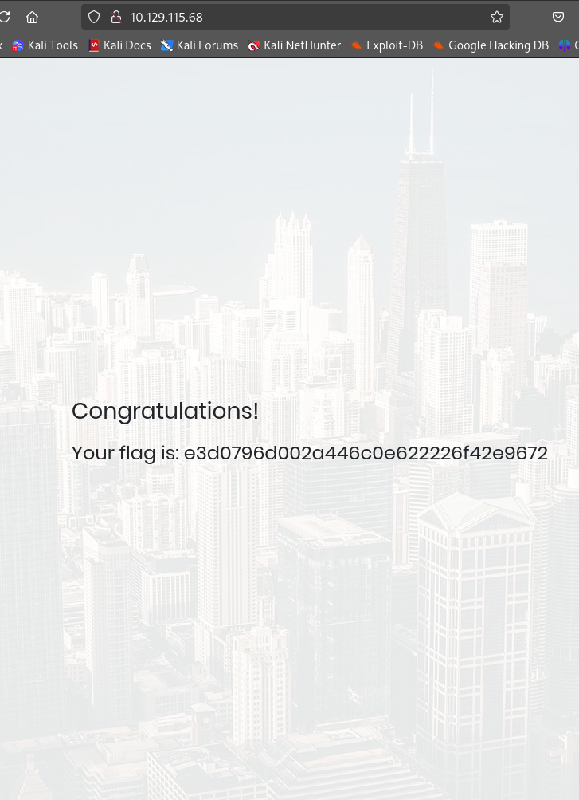

# Appointment write-up
_author: sUdO3_

## Introduction
Appointment is a box that is mostly web-application oriented. found in [Hack the box platform](https://app.hackthebox.com).In this machine we will find out how to perform an *SQL Injection* against an SQL database enabled web application.  

**SQL Injection (SQLi)** is a common web vulnerability that occurs when an application includes user input directly into SQL queries without proper sanitization. This allows an attacker to manipulate the query and interact with the backend database in unauthorized ways.

With a successful SQL injection, an attacker can:

- Bypass login authentication
- Access or leak sensitive information (usernames, passwords, etc.)
- Modify or delete data from the database
- In some cases, achieve remote code execution

Lets go straight to our target.  

## Enumeration
first we spawn our machine and then we perform an Nmap scan to find the open and available ports and their services.


  
  From our Nmap scan we detect that the only open port is port 80 TCP, which is running the *Apache httpd 2.4.38 ((Debian))*
.
Apache HTTP Server is a free and open-source application that runs web pages on either physical or virtual
web servers. It is one of the most popular HTTP servers, and it usually runs on standard HTTP ports such as
ports 80 TCP, 443 TCP, and alternatively on HTTP ports such as 8080 TCP or 8000 TCP. HTTP stands for
Hypertext Transfer Protocol, and it is an application-layer protocol used for transmitting hypermedia
documents, such as HTML (Hypertext Markup Language).  

From our Nmap scan we now have the exact version of the Apache http service which is 2.4.38. we will search to the internet to look for the available vulnerability of these version.  
Also for further enumeration we will navigate directly to the IP address of the target from our Browser.This open a website containing a login form.

  

## Foothold
We can use Gobuster to look for hidden files and directories. Also we can try default credentials such as,  

*admin:admin*  
*root:root*

and others, This brings us to SQL injection. We will use the script   
*admin'#*, password we will write anything,
   


This input is designed to **bypass login authentication** by breaking the SQL query and commenting out the rest.

####  How it works:

Assume the application runs this SQL query behind the scenes:


```sql
SELECT * FROM users WHERE username = '<input>' AND password = '<input>';
```

If we enter:  

Username: admin'#  
Password: (anything)

The query becomes:
```sql
SELECT * FROM users WHERE username = 'admin'#' AND password = '...';
```

In SQL, the # symbol is a comment in MySQL (similar to -- in other databases).
It tells the database to ignore everything after it on the same line.

So the query is interpreted as:
```sql
SELECT * FROM users WHERE username = 'admin'
```

This tricks the application into logging us in as the admin user without checking the password.  
  


✅ Access Gained

After submitting the payload, we are logged in as admin.

Login Success

    🎉 Boom... we’re in!

From the admin panel, we retrieve the user flag and confirm full access to the web application.

##  Conclusion

This machine was a classic example of a web-based vulnerability — specifically, **SQL Injection**.  
We began by identifying the open HTTP port, discovered a login page, and successfully exploited a lack of input sanitization to bypass authentication.

Through this process, we demonstrated how improper handling of user input can lead to full administrative access and exposure of sensitive data.

###  Key Takeaways:

-  Always validate and sanitize user input on both client and server sides  
-  Use parameterized queries or ORM libraries to prevent SQL injection  
-  Never expose detailed SQL errors in production environments  

This exercise emphasizes the critical importance of secure coding practices in web application development.

---

_Thanks for following the walkthrough!_  
**— sUdO3**


