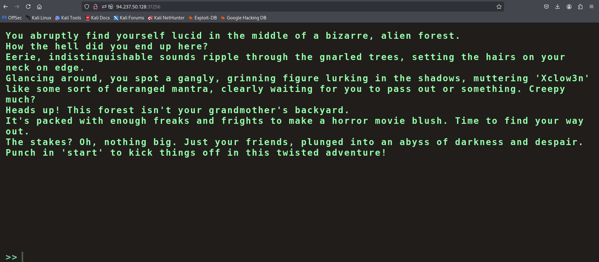
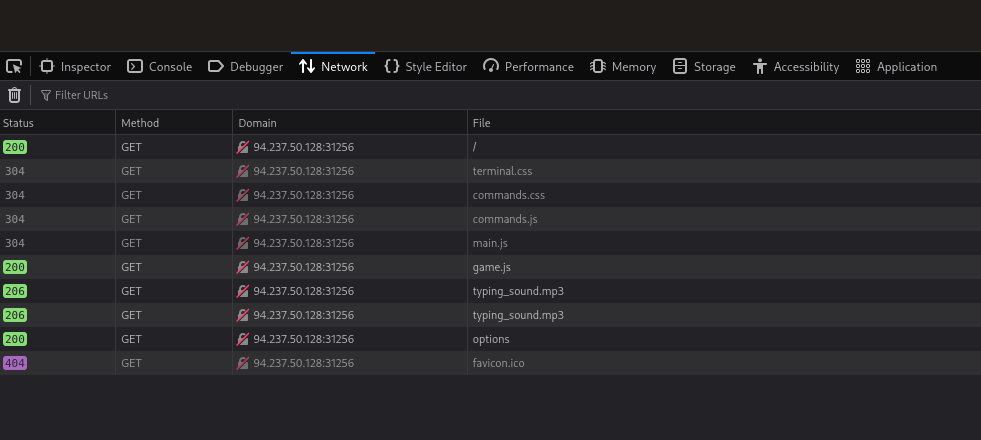
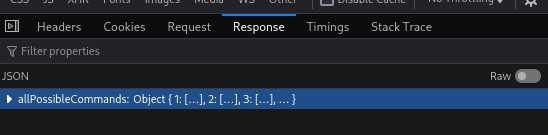
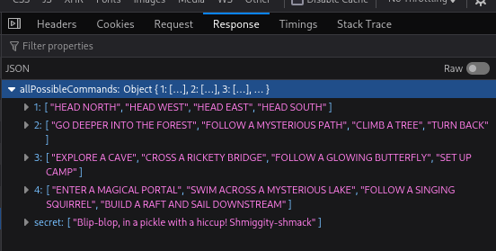
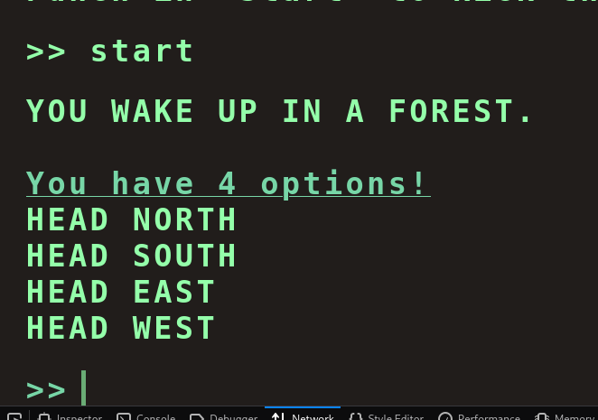
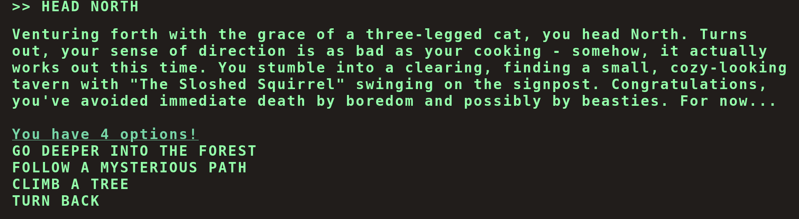
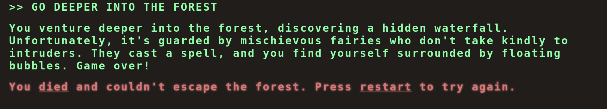
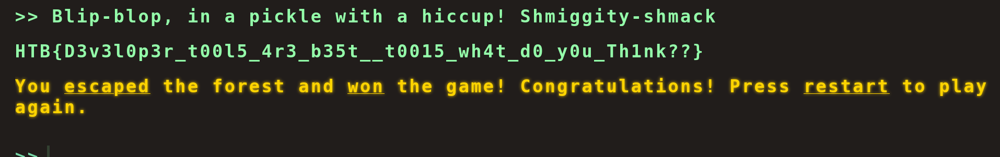
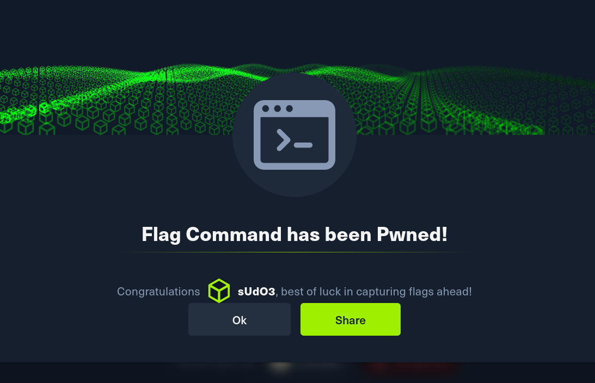

# Flag Command Write‑Up

## Description
**Flag Command** is a web‑based challenge found on the [Hack The Box](https://hackthebox.com) platform.  
The objective of this challenge is to identify a **hidden command** within the web application that reveals the flag.

We are provided with the target machine's IP address.  
When accessing the IP address through a web browser, we are presented with a web page as shown below.

---

## Web Enumeration
At first glance, the web page appears very simple and does not expose any obvious input fields or commands.  
Instead of guessing, we open the **Developer Tools** and navigate to the **Network** tab, then reload the page.

During the reload, we observe that the browser makes a request to an **`options` endpoint**.

---

## Discovering the Hidden Secret
Inspecting the response from the `options` endpoint reveals a **hidden secret**.

Once properly viewed or interpreted, the hidden secret becomes clear.

### Important Observation
This shows that the application relies on **client‑side communication**, and sensitive information is exposed through API responses rather than the main page.

---

## Interacting With the Application
Returning to the web page, we type **`start`** as instructed by the discovered response.

This action presents us with **four different options**.

---

## Dead Ends
Trying all four options leads us to another set of options, but every possible path results in a **dead end**.

### Why This Happens
- The visible options are **decoys**
- The challenge is designed to test **enumeration skills**
- The real solution is not meant to be obvious from the UI alone

---

## Using the Hidden Command
Instead of continuing down dead ends, we use the **hidden secret command** discovered earlier.

---

## Flag Found 🎉

**Boom!**  
The hidden command successfully executes and the **flag is revealed**.

---

## Key Takeaways
- Always inspect **network traffic** in web challenges
- Hidden API endpoints often contain valuable clues
- Not all valid commands are visible in the UI
- Dead ends are commonly used to mislead attackers
- Client‑side logic can leak secrets if improperly designed

---

## Conclusion
The Flag Command challenge highlights the importance of **web enumeration and traffic analysis**.  
By carefully inspecting network requests and understanding how the application communicates with its backend, we were able to uncover the hidden command and retrieve the flag.

---

**Written by sUdO3**
