# CYBERCHAMPION 2026 semi-final POC writeup
## USERNAME: sUdO3


flag format
```bash
 tzcert{.....}
 ```
 ## Challenge: PDF Plus
 ## Category: Reverse Engineering
### DESCRIPTION
This document seems like a plain field for mining ? Get to diging?


#### SOLUTION
The initial step was to extract the provided zipped file. Inside, there was a PDF document. Opening the PDF revealed that it contained only one word: YES.


I used the file command to verify whether the document was a valid PDF file.
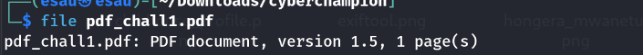

I then used exiftool to further confirm that the file was a legitimate PDF document.

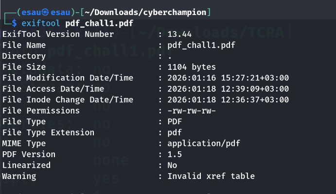

Both the file command and exiftool confirmed that the document is a valid PDF file. The next step was to examine the PDF metadata and document information.

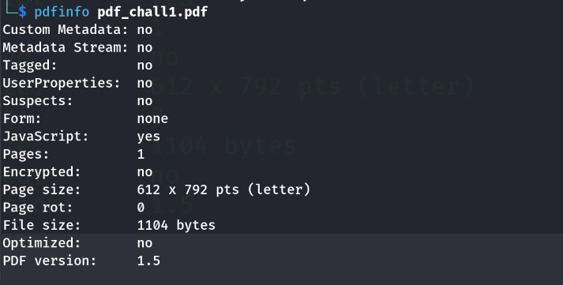

Using pdfinfo, I discovered that the PDF file contains embedded JavaScript. This was a significant finding, since JavaScript in PDF files can be used to execute actions automatically, hide malicious behavior, or reveal hidden content when the document is processed.

The next step was to use the pdf-parser tool to analyze the internal structure of the PDF file. This tool allows inspection of objects, streams, and embedded scripts, making it possible to identify hidden data, obfuscated JavaScript, or clues concealed within the document.
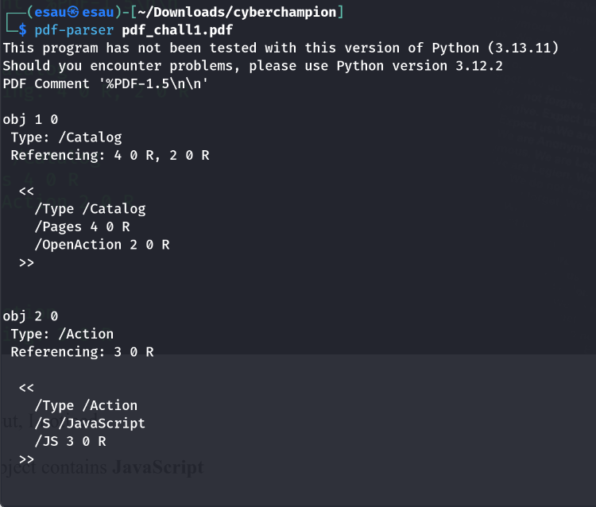
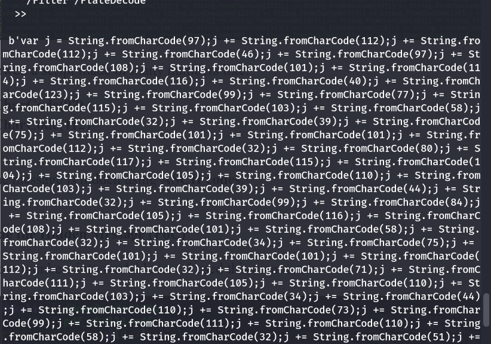
Using pdf-parser, I observed that the message was hidden in ASCII format within the PDF structure.
I extracted the ASCII-encoded data from the file.
I then decoded the extracted ASCII data, which revealed the hidden message containing the flag.

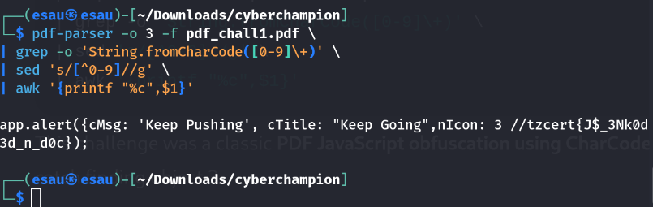
## Challenge: Broadcasting Secrets Since 802.11
## Category: Wi-Fi
 ### Description
 The password of the wifi is related to the name of the access point

 ### Solution
 As usual, the challenge provided a zipped file. The first step was to extract the archive in order to inspect the contents and identify the files provided.
 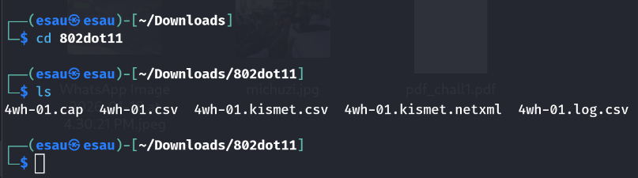

 #### Reconnaissance and File Analysis

After extracting the provided ZIP archive, the following files were obtained:
```
4wh-01.cap
4wh-01.csv
4wh-01.kismet.csv
4wh-01.kismet.netxml
4wh-01.log.csv
```


These files were generated during a wireless capture session and are commonly associated with Wi‑Fi reconnaissance tools such as airodump‑ng and Kismet. Each file serves a specific purpose in the reconnaissance phase.

1. 4wh-01.cap

This is the most critical file for the challenge. It contains the raw packet capture, including the WPA/WPA2 four‑way handshake. This file is later used during the cracking phase with tools such as aircrack-ng or hashcat to test password candidates against the captured handshake.

2. 4wh-01.csv

This file provides a summarized view of discovered access points and connected clients. It includes important reconnaissance details such as:

BSSID (Access Point MAC address)

Channel

Encryption type

ESSID (Wi‑Fi network name)

This file was used to quickly identify the target access point name, which is essential since the challenge specifies that the password is related to the AP name.

3. 4wh-01.kismet.csv

This file is generated by Kismet and contains structured information about detected wireless networks and devices. It offers additional metadata that helps validate:

Network name (ESSID)

Signal strength

Security configuration

It serves as a secondary source to confirm information found in the standard CSV file.

4. 4wh-01.kismet.netxml

This XML‑based file provides a more detailed, machine‑readable representation of the wireless environment. It includes:

Access point details

Client associations

Encryption methods

This file is especially useful for deeper analysis and automation, and it further confirms the identity of the target access point.

5. 4wh-01.log.csv

This file contains logging information from the capture process, including timestamps and event records. While not directly used for cracking, it helps verify capture activity and ensures that the handshake was successfully recorded.

#### Reconnaissance Outcome

Through analysis of the CSV and NetXML files, the target access point name (ESSID) was identified. Since the challenge description states that the Wi‑Fi password is related to the access point name, this information guided the wordlist generation process.

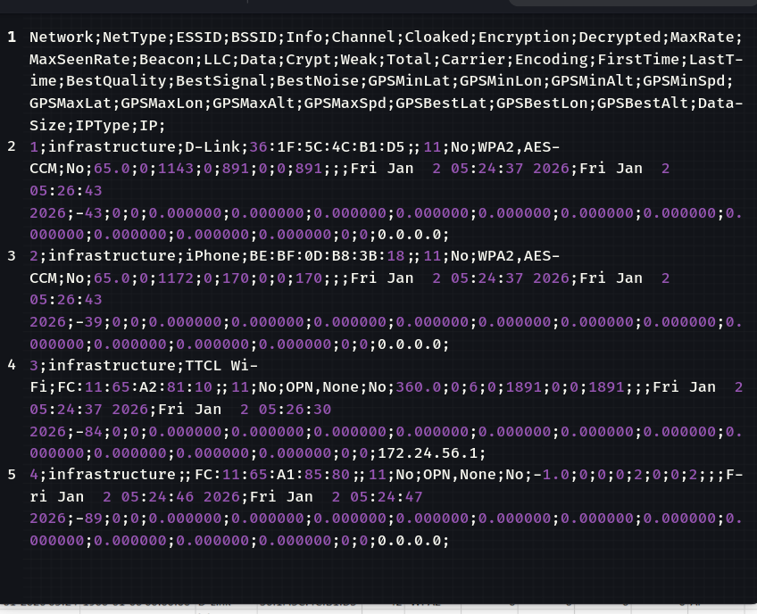

#### Target Selection

During the reconnaissance phase, three wireless networks were identified from the capture files:

iphone

D-Link

TTCL WiFi

Following a CTF-oriented approach, D-Link was selected as the initial target. This decision was based on two key factors:
first, the challenge description explicitly states that the Wi-Fi password is related to the access point name, and second, D-Link is a commonly reused default or modified SSID, making it a strong candidate for password derivation.

Using the identified AP name, a targeted wordlist was created by applying transformations such as reuse, reversal, and mirroring. This wordlist was then used against the captured handshake in the .cap file to crack the Wi‑Fi password.

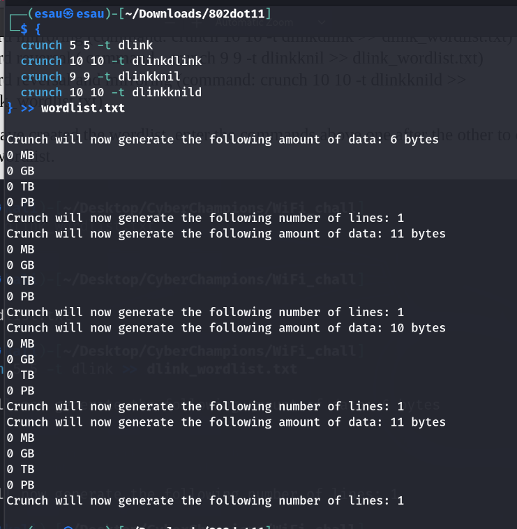

Lastly, the custom wordlist generated from the D-Link access point name was used to perform a dictionary attack against the WPA four-way handshake stored in the .cap file. The correct password was successfully recovered once a matching hash was identified.

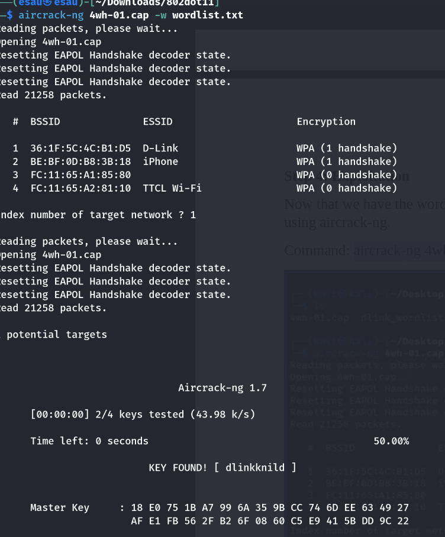

flag  tzcert{dlinkknild}

## Challenge: Kazi ipo
## Catwgory: Warm up

After downloading the provided file, it was observed that the challenge included an audio file named salamu.mp3. To verify whether the file was a genuine MP3 audio file and not a disguised or modified file, the file command was used to inspect its format based on file signatures rather than the extension.
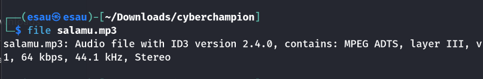
After confirming that the file was a valid MP3 and finding no anomalies during playback, exiftool was used to analyze the file’s metadata for hidden messages or irregular fields that could provide additional clues.
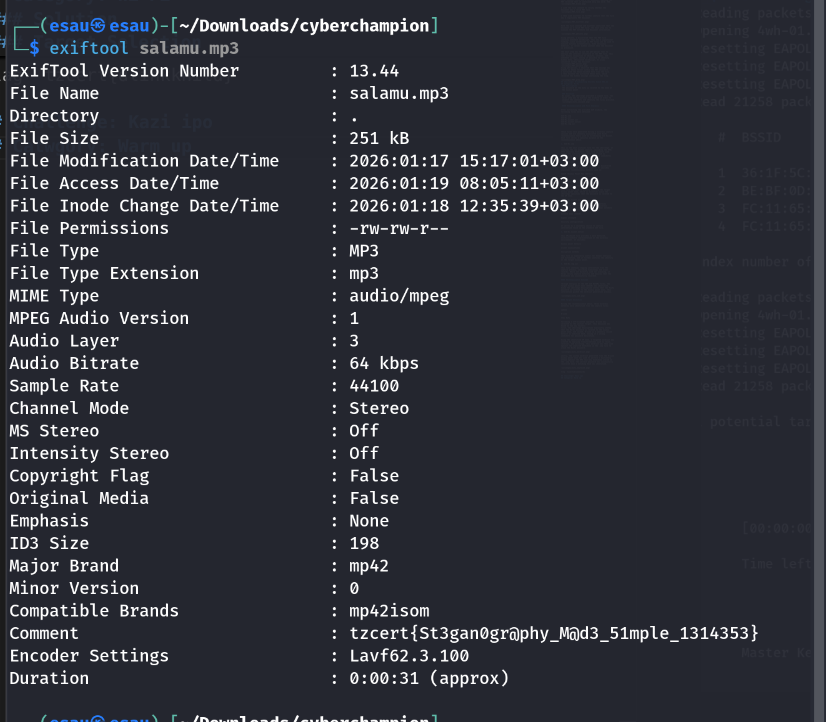

Boom! The metadata analysis paid off. While inspecting the audio file using exiftool, the flag was discovered embedded within the comment field of the MP3 metadata:

 #### flag  tzcert{St3gan0gr@phy_M@d3_51mple_1314353}


## Challenge: LUCKY MISMATCH
## category: OSINT
### Description
What was the license plate number in the police report that did not match the plate number on the insurance coverage document? This mismatch is what cleared the insurance company from having to pay the claimant. Format: tzcert{Y###ZZZ}
### Explained
An insurance claim was filed following an incident, but the insurance company refused to compensate the claimant due to a critical discrepancy. Upon investigation, it was discovered that the license plate number recorded in the police report did not match the license plate number listed on the insurance coverage document.

This mismatch was the key factor that cleared the insurance company from having to pay the claim.

### Objective

Identify the license plate number found in the police report that did not match the one on the insurance document.
After downloading and opening the provided file, an image was discovered as the main content of the challenge.
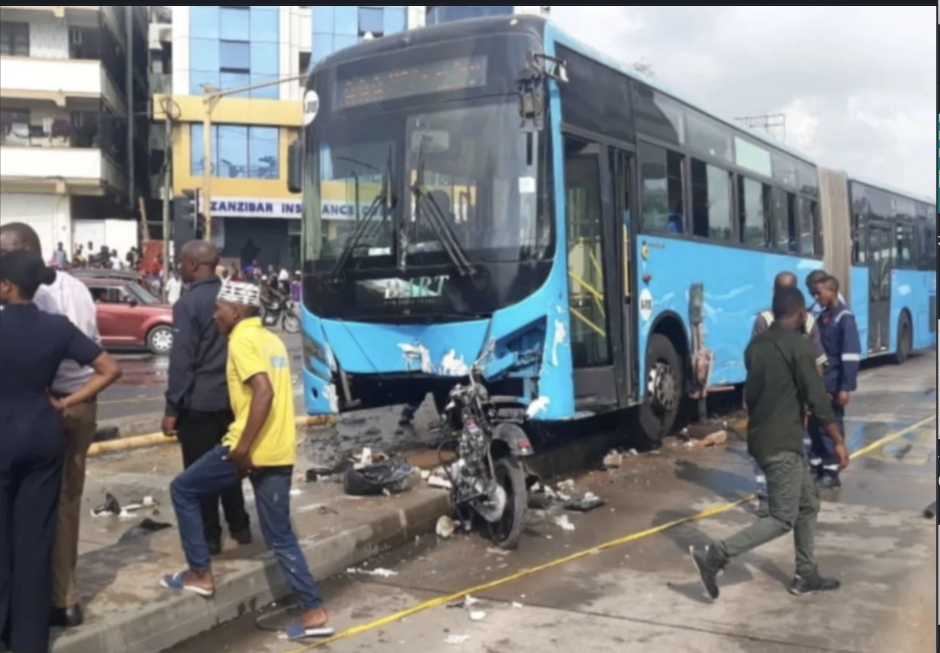

After opening the image in a browser, further investigation was carried out by following related links and performing external searches. Using Google AI tools during this process, the case number associated with the image was successfully identified.
### (Case No. 28992 of 2024) 
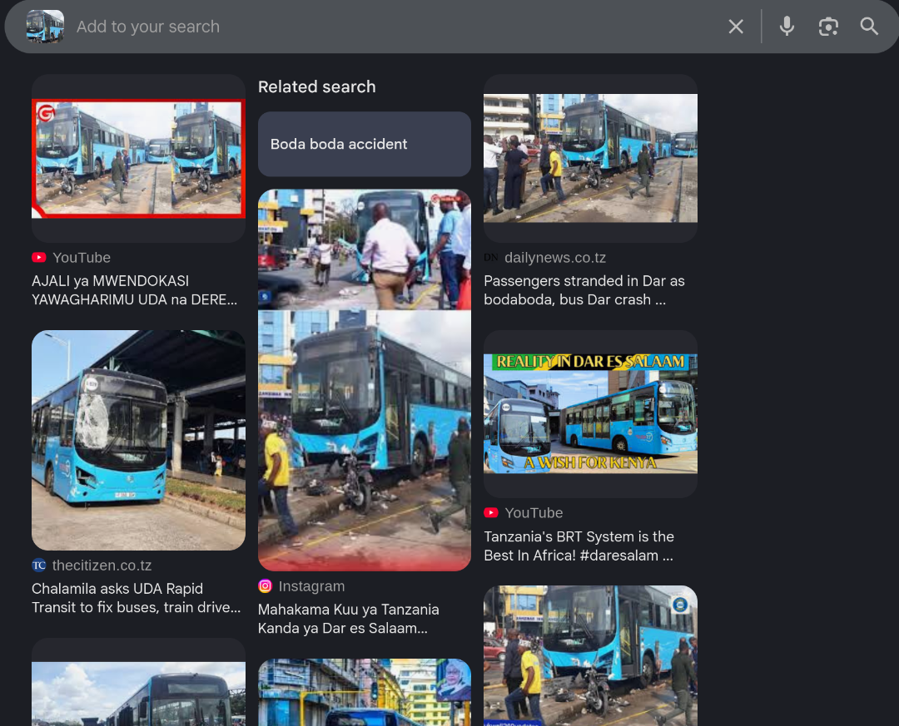
I Searched the case number in a web browser and located the official case document online.
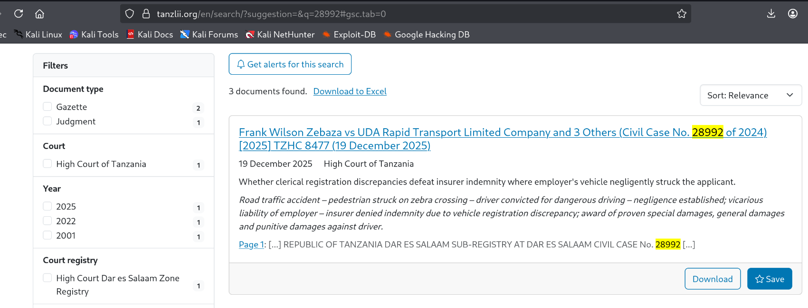
I Opened the case document found online and reviewed its contents. The flag was the motorcycle plate number mentioned in the document.
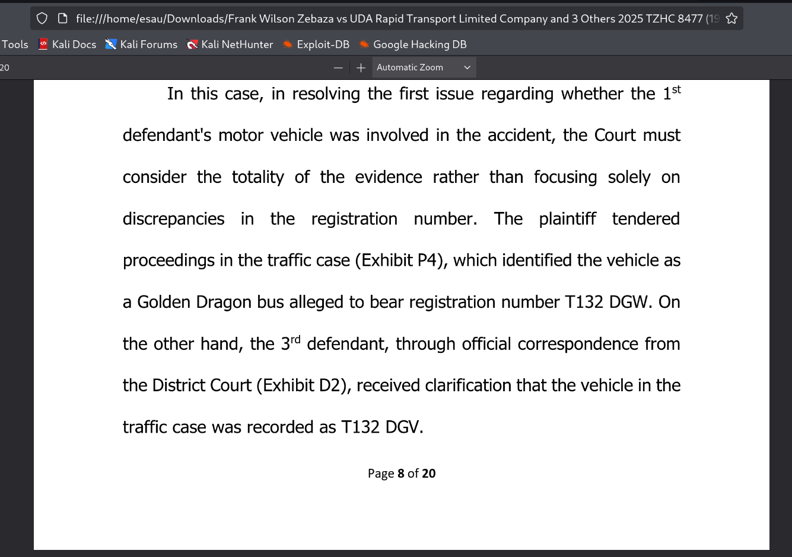

#### flag tzcert{T132DGV}

## Challenge: GOALS
## Category: OSINT
### Description 
The person featured in this post
http://issamichuzi.blogspot.com/2005/12/hongera-mwanetu.html
has a Clubhouse account. What is the Instagram user ID of the user who invited them to Clubhouse?
### Solution
Opening the link http://issamichuzi.blogspot.com/2005/12/hongera-mwanetu.html
 in a browser, we found a blog post
 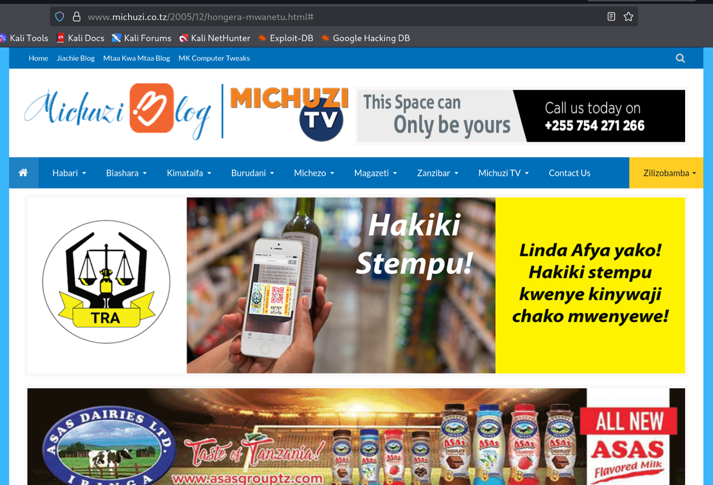
 Since the challenge mentions “Hongera Mwanetu”, I checked the blog and found that Nancy Sumary is congratulated for winning Miss World 2005.
 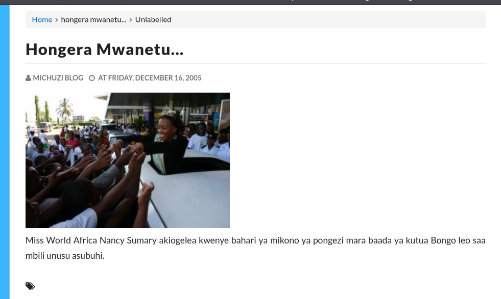
 Then, I searched for Nancy Sumary’s Clubhouse profile.
 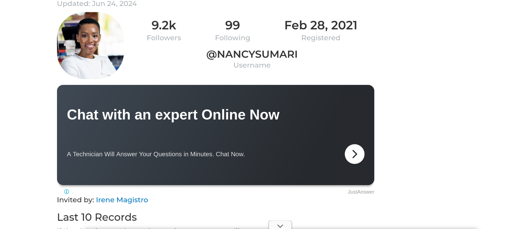
 I found that she was invited to Clubhouse by Irene Magistro, so I then searched for Irene Magistro’s Instagram profile.
 
 Then, I asked AI to find the Instagram user ID for Irene Magistro and obtained it. This user ID is the flag.
 #### flag tzcert{177164433}


 #### flag tzcert{FRiD4_X0R_CRYPT0_2025}

 ## Challenge: CIA
 ## Category: Warm Up

 I opened the given file and identified a Base64-encoded string. Using the echo command, I decoded the string to obtain the original content.
 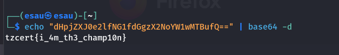

 #### flag tzcert{i_4m_th3_champ10n} 
 