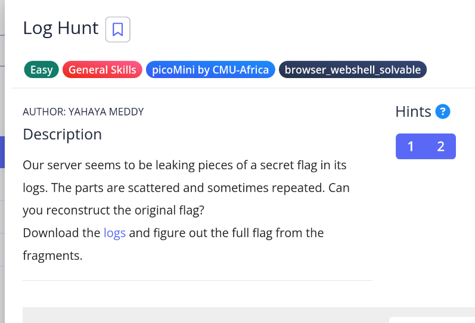
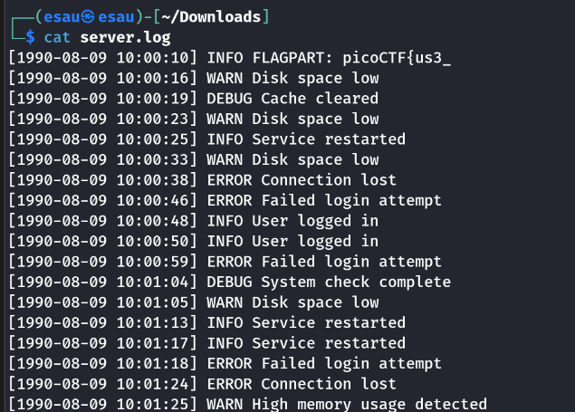
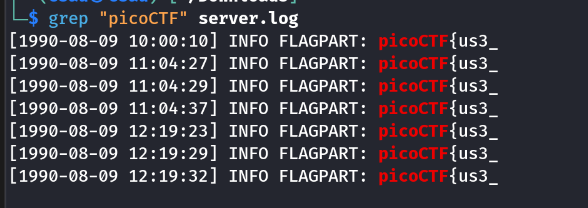
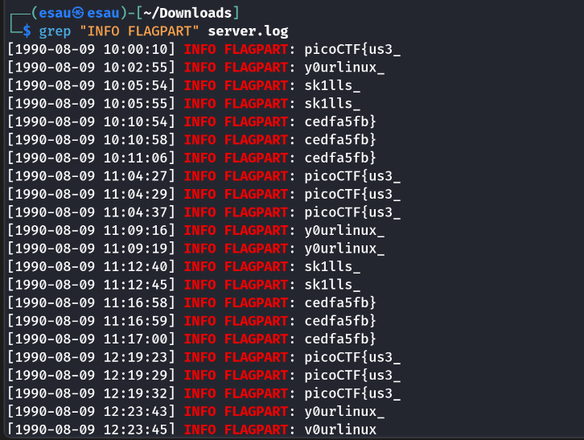

# picoCTF Writeup
## Author: sUdO3
### Challenge 1 : loghunt
### Category: General Skills

After downloading the log file, we obtain a file named server.log, which contains a large number of log entries.

The goal of this challenge is to extract the flag using the Linux command:
``` bash
grep
```

First, we search for the keyword:

"picoCTF"


From the output, we observe that logs containing parts of the flag are labeled with INFO FLAGPART.
Based on this, we use grep to filter logs containing this keyword.


After collecting all the flag parts, we join the different pieces together and ignore any repeated entries.
This gives us the complete flag.

### Flag: picoCTF{us3_y0urlinux_sk1lls_cedfa5fb}


### Challenge: Crack the gate 1
### Category: Web exploitation

